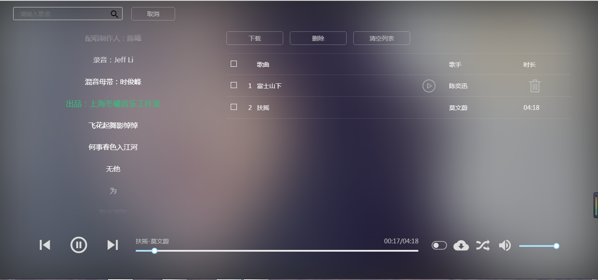
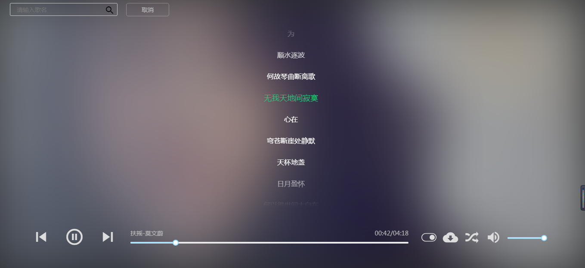

## react-music


> 基于 react开发，算是一个纯前端吧！第一次使用react，用来练练手,页面仿pc端qq音乐，没有使用第三方组件

> 可以听qq音乐中的所有音乐,好像github这个页面显示不支持，只能下下来自己运行了

### 预览


 
### 功能方面

所有接口均来自qq音乐。[demo体验](https://haipingxiaotong.github.io/music/demo/)

- 线上地址没有歌词，歌词需要启动服务！！！
- 歌词显示
- 歌曲下载
- 歌曲列表记录


### 使用

```javascript
git clone https://github.com/HaipingXiaotong/music.git

npm install 

npm start

```